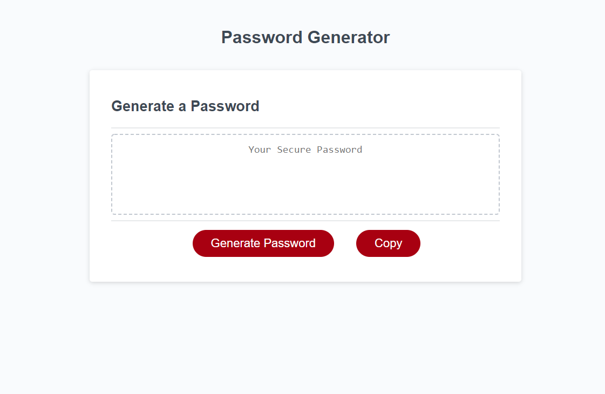

# homework-wk3
Submission for the Homework for Week 3 (Password Generator)

In completing this homework task, I broke the work down into the following:
```
1. Getting the desired length:
    a. created function (lengthFunc())
    b. prompting for a number
    c. error checking for anything that was not a number
    d. error checking that the length that the user inputs is between 8 and 128
        i. this lead to making constants for minimum and maximum
2. Getting the desired criteria:
    a. created function (charTypeFunc())
        i. confirm alerts for each of the four criteria
        ii. push the results to an array
        iii. check that the array has at least one value
    b. created function (charSetFunc(array))
        i. checks which values for the array are true
        ii. then adds the corrisponding letters/numbers/symbols to a string
3. Getting the password:
    a. using the generatePassword() function supplied
        i. set variables to the above functions
        ii. add to an empty string in a loop, looping the amount of times that the desired password length, 
        a random character from the string made in the charSetFunc(array)
4. Left any code that was given
5. Added a copy button:
    a. created function copy()
    b. selects the password
    c. runs document.execCommand("copy") to copy to clipboard allowing the user to paste it where desired
    d. created copy button
    e. added event listener to button to allow the function to run
6. refractor code
7. comment code
8. create README.md
```



GitHub Pages: https://djtoohey.github.io/homework-wk3/main/Develop/index.html
